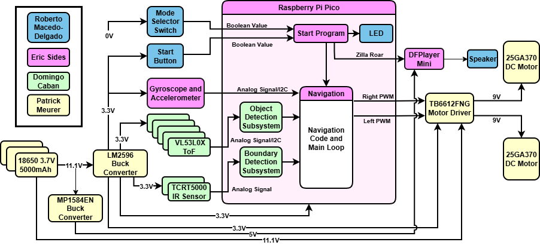
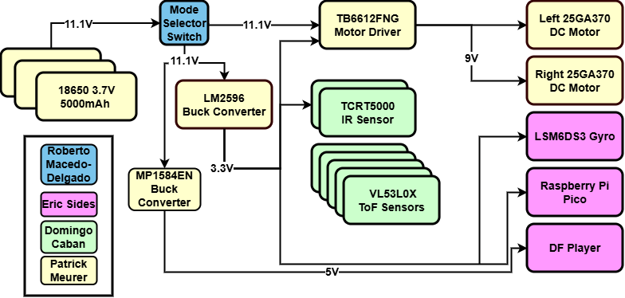
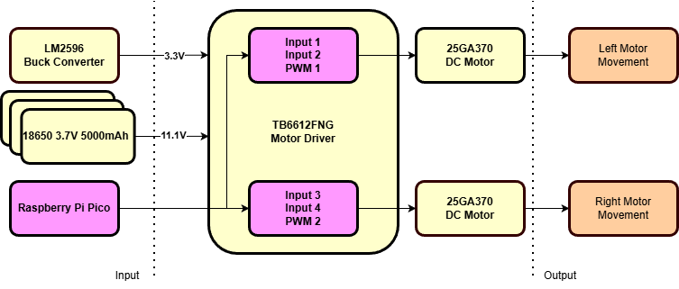
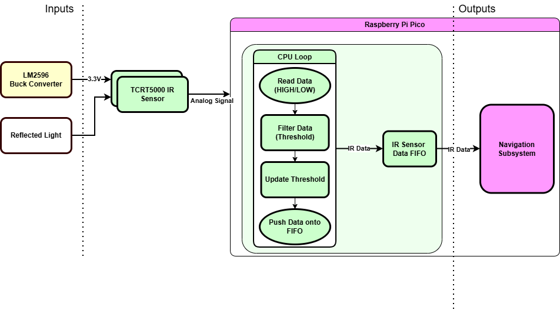
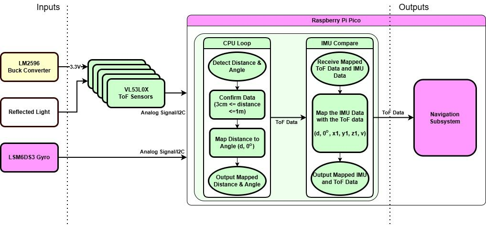
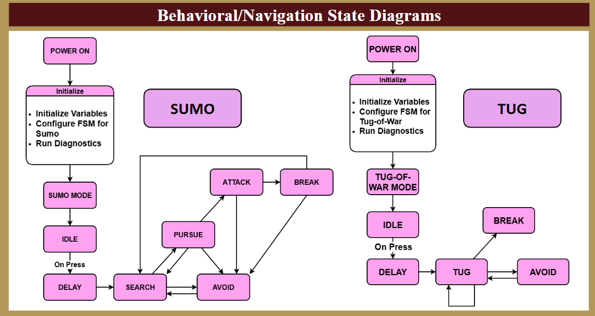
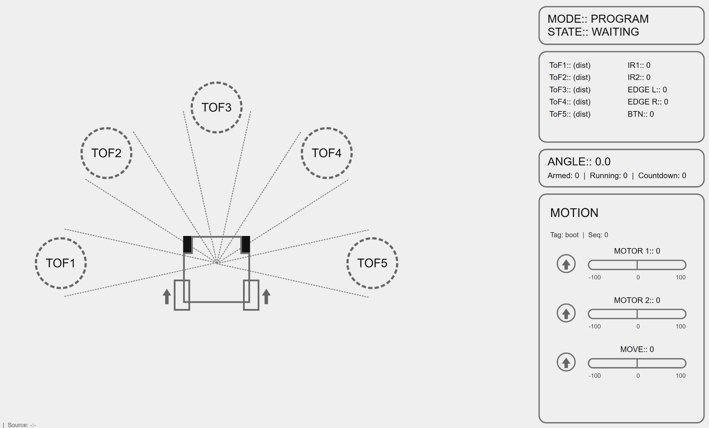

# Architecture Diagrams

This page provides GitHub-viewable PNG versions of the system and navigation diagrams. The PNGs are exported from the D2 project-management and design-review materials.

The original editable sources remain available here:

- [IDR / design-review Draw.io source](../diagrams/idr-presentation.drawio)
- [Poster Draw.io source](../diagrams/poster.drawio)

## Top-Level System

## Power Block Diagram

## Motor Control Diagram

## Sensor Subsystem Diagrams

| Boundary Detection | Object Detection |
| --- | --- |
|  |  |

## Navigation Block Diagram

## Navigation State Diagrams

## Telemetry Wireframe

## Notes

- These images are intended for quick public viewing on GitHub and preserve the original design-review visual style.
- The Draw.io files are kept as the editable design-review sources.
- The diagrams are documentation artifacts and should be read alongside the source-code walkthrough and testing results.
