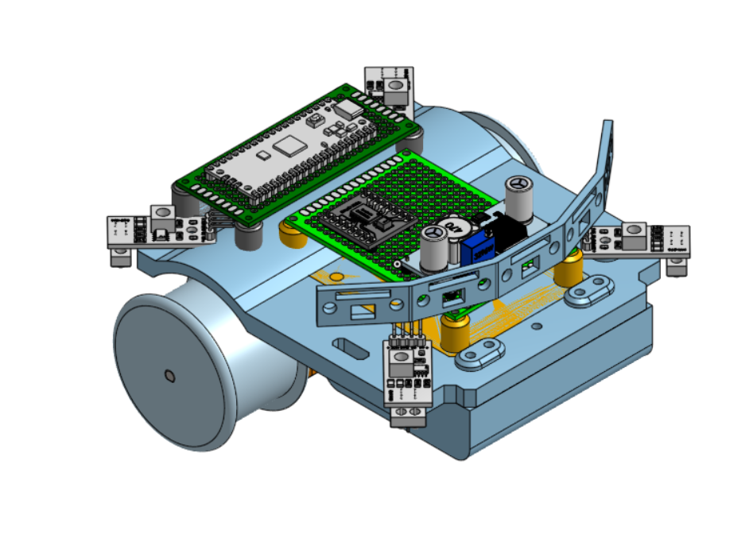
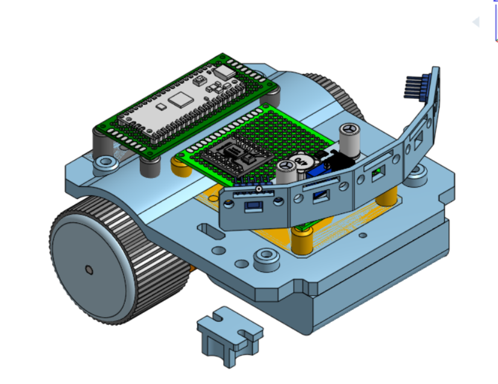
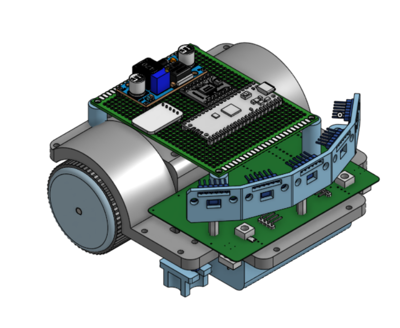
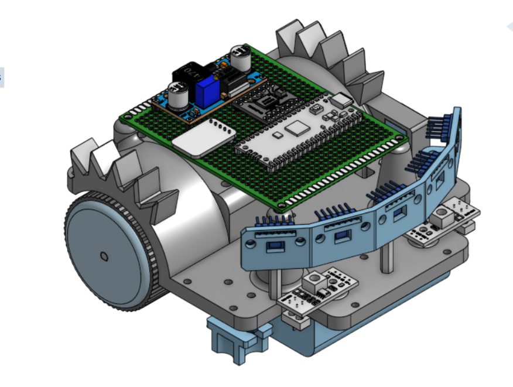
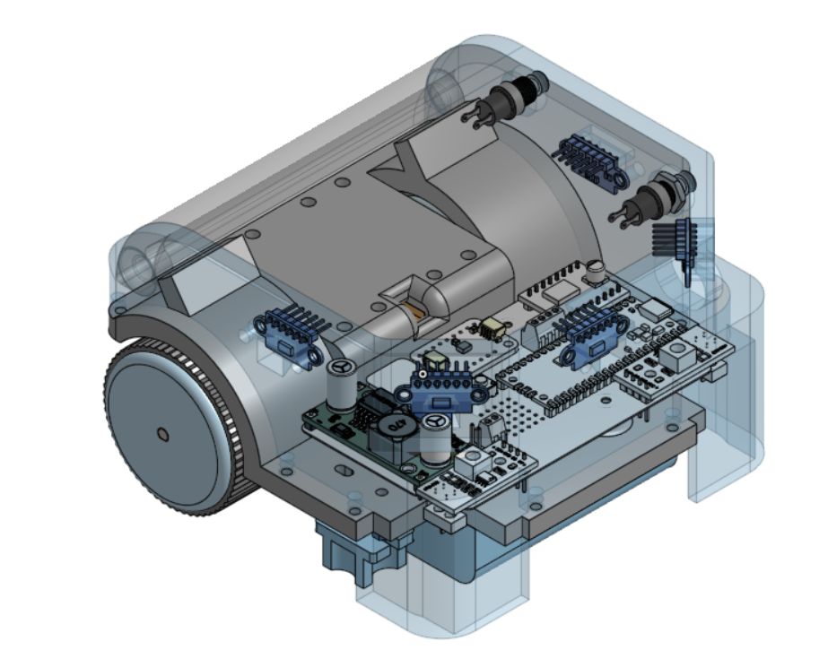
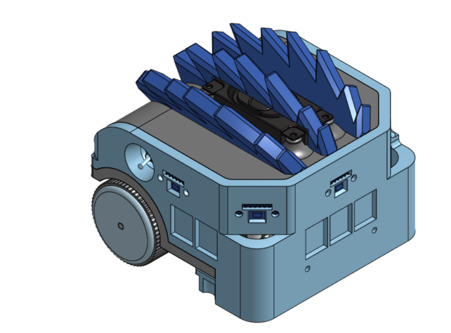

# Hardware Assets

This page indexes the selected CAD, PCB, drawing, and diagram assets included in the portfolio repository.

## CAD and 3D-Printed Parts

| File | Purpose |
| --- | --- |
| [final-chassis.stl](../hardware/cad/final-chassis.stl) | Final chassis model |
| [final-enclosure.stl](../hardware/cad/final-enclosure.stl) | Final enclosure model |
| [motor-mount-left.step](../hardware/cad/motor-mount-left.step) | Left motor mount |
| [motor-mount-right.step](../hardware/cad/motor-mount-right.step) | Right motor mount |
| [poly-wheel.step](../hardware/cad/poly-wheel.step) | Wheel component model |
| [silicone-wheel.step](../hardware/cad/silicone-wheel.step) | Wheel component model |
| [battery-cover.step](../hardware/cad/battery-cover.step) | Battery cover model |

## PCB and Electrical Design

| File | Purpose |
| --- | --- |
| [zillabot-gerber.zip](../hardware/pcb/zillabot-gerber.zip) | PCB fabrication Gerber package |
| [pcb-layout.png](../images/design/pcb-layout.png) | PCB and subsystem layout image |

## Drawings and Diagrams

| File | Purpose |
| --- | --- |
| [chassis-v5-drawing.svg](../hardware/drawings/chassis-v5-drawing.svg) | Chassis engineering drawing |
| [idr-presentation.drawio](../diagrams/idr-presentation.drawio) | Design-review diagram source |
| [poster.drawio](../diagrams/poster.drawio) | Poster diagram source |

## Chassis Revision Images

| Revision | Preview |
| --- | --- |
| V1 |  |
| V2 |  |
| V3 |  |
| V4 |  |
| V5 |  |
| V6 |  |
| V7 |  |

## Notes to Add Later

- `[Add CAD software used]`
- `[Add 3D printer/material settings if relevant]`
- `[Add PCB toolchain and board revision notes]`
- `[Add what changed between chassis revisions]`
