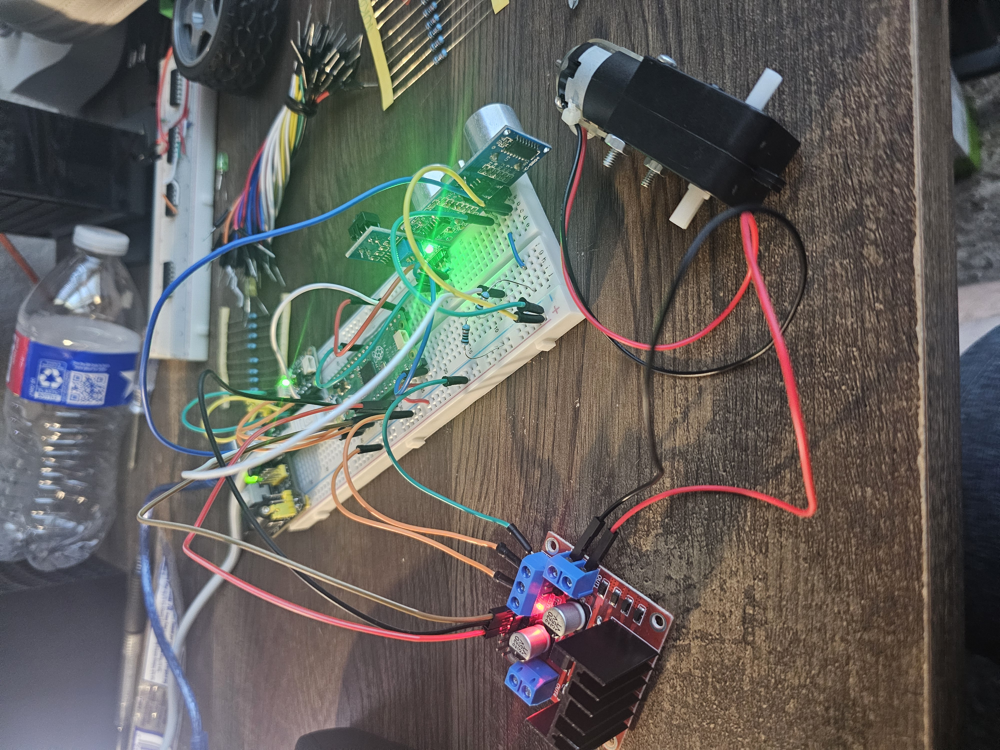
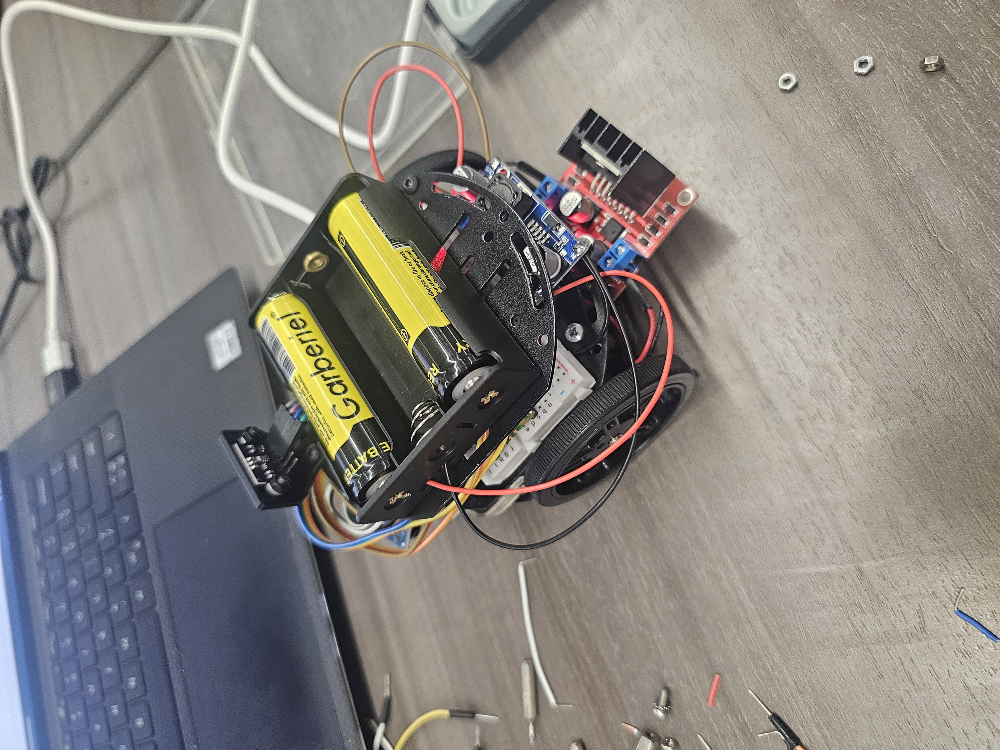
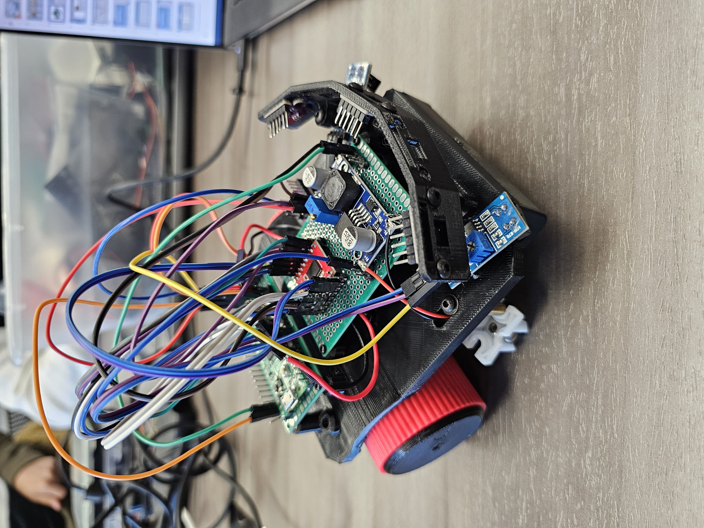
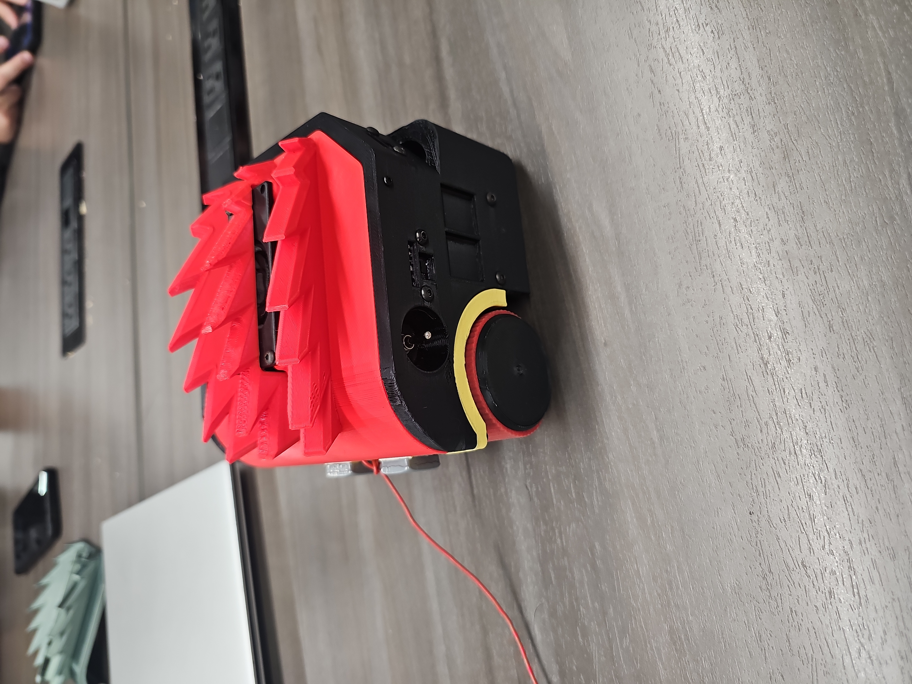
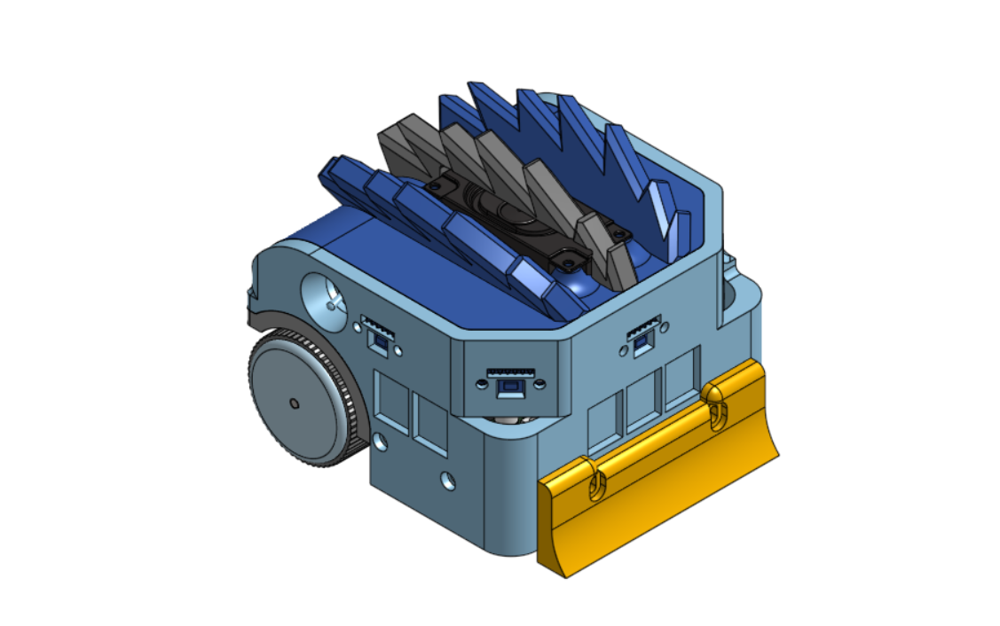
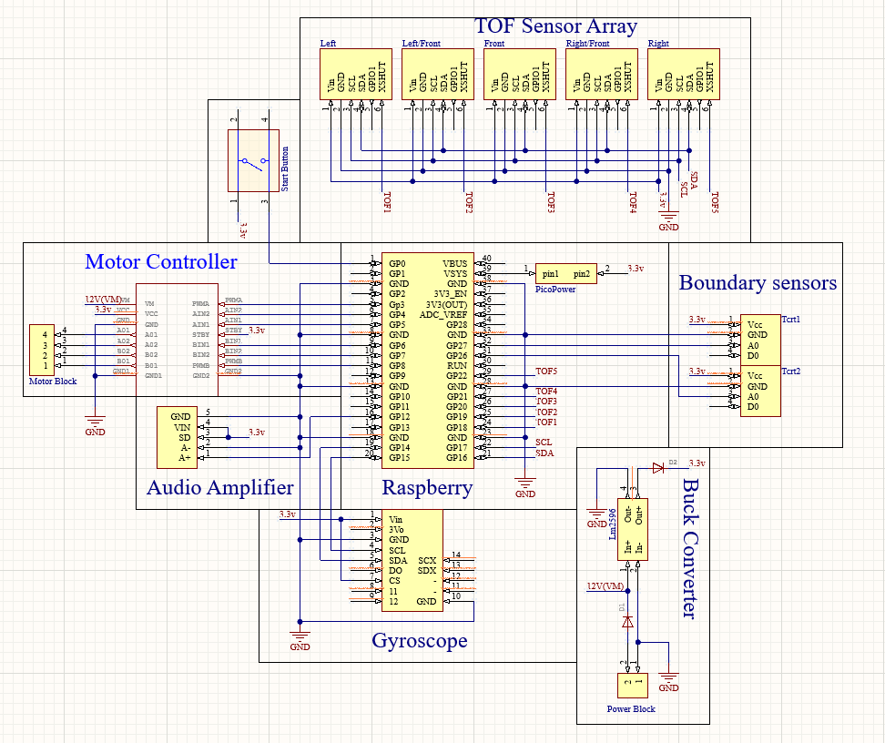
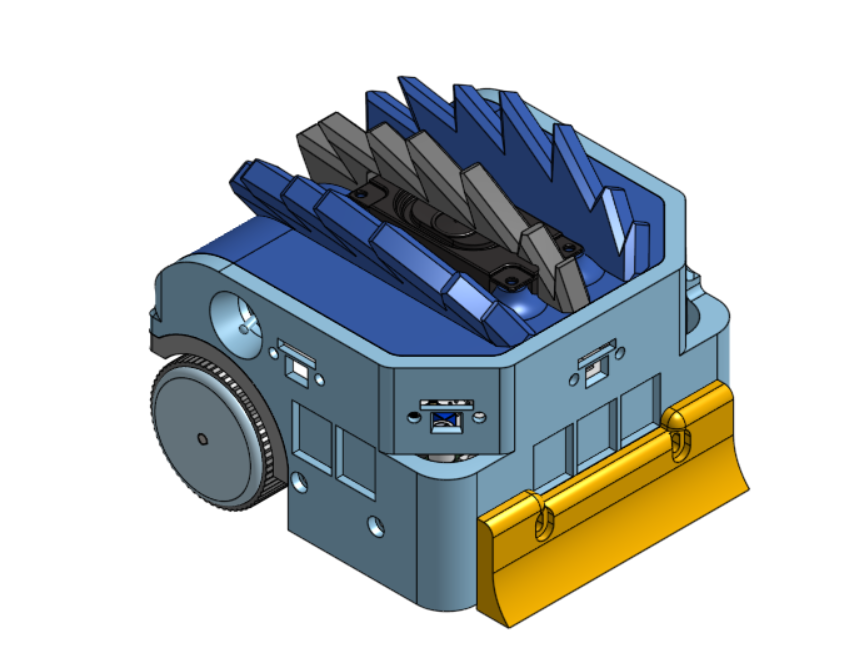

# Media Gallery

This page collects the visual evidence for ZillaBot's build progression, design iteration, and demonstration runs.

## Build Progression

| Stage | Image | What It Shows |
| --- | --- | --- |
| Early electronics prototype |  | Microcontroller, motor driver, sensor, and power testing on a breadboard setup |
| First mobile prototype |  | Battery, motor driver, drivetrain, and early mobile wiring integration |
| Integrated prototype |  | 3D-printed chassis with mounted electronics and sensor wiring |
| Final enclosed robot |  | Final exterior form with front attachment and enclosed body |

## Design and CAD References

| Asset | Preview |
| --- | --- |
| Final CAD render |  |
| PCB and subsystem layout |  |
| Chassis V7 render |  |

The full CAD and PCB file index is in [Hardware Assets](hardware-assets.md).

## Demo Videos

- [April 13 demo run](../videos/2026-04-13-demo-run.mp4)
- [May 10 competition run](../videos/2026-05-10-competition-run.mp4)
- [Short demonstration clip](../videos/short-demo-clip.mp4)

## Testing Visuals

- [Arena setup photo](../images/testing/build-test-setup.jpg)
- [TCRT distance reference](../images/testing/tcrt-distance.png)
- [ToF reflection reference](../images/testing/tof-reflections.jpeg)

## Notes

The gallery uses the strongest public visuals currently available in this repository. Additional labeled wiring photos, team photos, or competition-day images can be added later if they are approved for public sharing.
