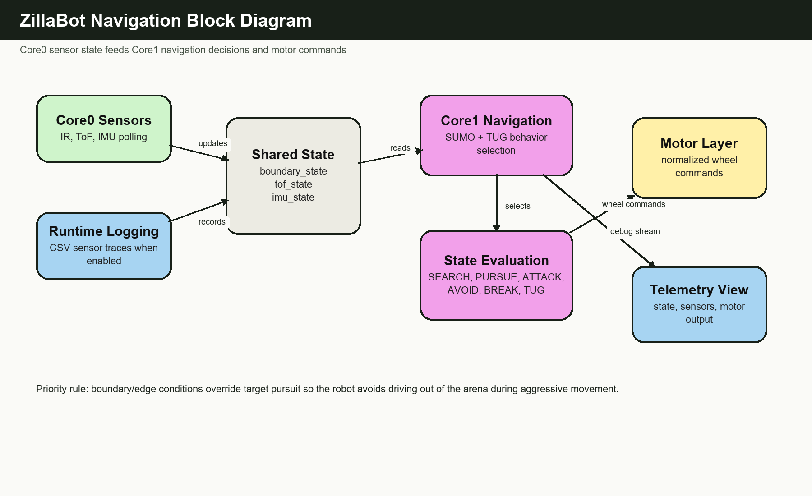
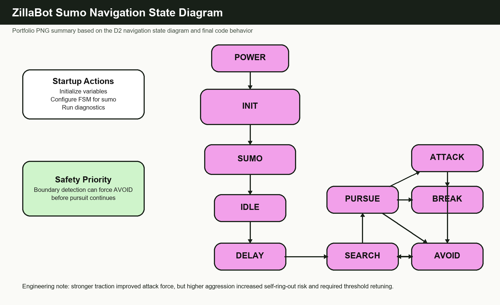
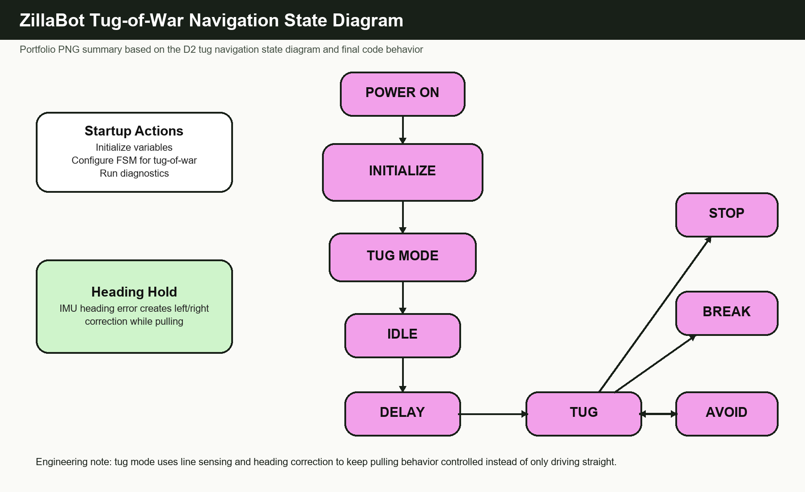

# Navigation Subsystem

## Purpose

The navigation subsystem determines how ZillaBot interprets sensor input and chooses movement actions in real time. Its goal is to keep the robot responsive during sumo and tug-of-war behavior while protecting against arena boundary conditions.

## Navigation Responsibilities

- Read and combine sensor information
- Identify the current operating situation
- Choose the next action or movement state
- Send movement intent to the motor control layer

## Inputs

- front-facing time-of-flight readings for opponent or object detection
- floor-facing boundary sensor readings for edge detection
- IMU values for orientation feedback
- mode selection inputs for switching between program, sumo, and tug behavior
- start input used before entering active match behavior

## Outputs

- movement intent sent to the motor control layer
- navigation state changes such as search, pursue, avoid, or tug behavior
- telemetry/debug outputs when enabled for testing

## Navigation Strategy

- Search behavior: move or turn until the sensor array identifies a meaningful target condition
- Pursuit behavior: drive toward a detected object or opponent using front sensor readings
- Avoid or recovery behavior: prioritize edge detection and reverse/turn behavior before continuing
- Mode-specific behavior: support different competition behavior for sumo and tug-of-war operation
- Break or protective stop behavior: stop/retry behavior is used when the robot stalls or remains immobile long enough to risk motor stress

## Final Configuration Evidence

The D2 final design review documented the tuned navigation configuration values below. These values are included as project evidence, not as a guarantee that every future run will behave identically under different floor, battery, or traction conditions.

| Behavior Area | Documented Setting | Result |
| --- | --- | --- |
| Boundary thresholds | Left: 38200, Right: 37400 | PASS |
| ToF detection range | 1000 mm | PASS |
| Search behavior | Turn: 0.22 s, Burst: 0.15 s, Speed: 0.4 | PASS |
| Avoid behavior | Reverse: -0.6 for 0.6 s, Turn: 0.2 for 0.2 s | PASS |
| Pursuit behavior | Base: 0.6, Attack: 0.8, Align: 0.9 | PASS |
| IMU turning | Filter: 0.10, Turn speed: 0.8 | PASS |

## State Machine Summary

The current portfolio snippet describes the state-machine concept here:

- [Navigation state machine snippet](../code-snippets/navigation-state-machine.md)
- [Design-review Draw.io diagrams](../diagrams/idr-presentation.drawio)
- [Rendered architecture diagrams](architecture-diagrams.md)

The design-review Draw.io source includes navigation block and state diagrams for the portfolio record. The linked snippet provides a readable summary of the same design approach: read sensors, prioritize safety conditions, choose a navigation state, and send movement commands.

| Sumo state diagram | Tug-of-war state diagram |
| --- | --- |
|  |  |

## Sensor Fusion and Priority Rules

Boundary and safety-related readings should be treated as higher priority than pursuit behavior. This keeps the robot from continuing an aggressive movement when an edge or unsafe condition has been detected.
The D2 navigation materials identify states including idle, delay, search, pursue, attack, avoid, break, and tug behavior. They also describe state evaluation as the point where sensor inputs are evaluated, a navigation state is selected, and fast safety-related conditions are prioritized.

## Known Challenges

- sensor readings can vary with surface, distance, and robot angle
- state transitions need to be fast enough for competition behavior
- motor response, battery level, and floor traction can change the observed behavior
- telemetry is helpful for debugging but should not slow down the control loop

## Remaining Limits in the Public Record

- Full replay plots from telemetry logs are not included in this public repository.
- Behavior across multiple floor materials or battery states was not formally summarized as a public trial table.
- Higher speed settings improved response but increased self-ring-out risk, especially after the traction upgrade.
