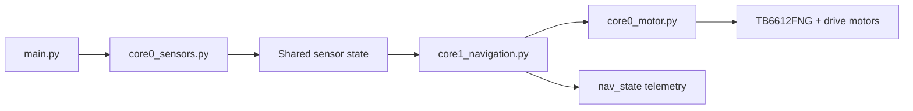

# Source Code Walkthrough

This page explains how the public ZillaBot source snapshot is organized. It focuses on the main runtime path across sensing, navigation, and motor output.

## Runtime Flow

ZillaBot separates fast sensor updates, decision logic, and motor commands into small modules:

## Startup and Mode Control

[main.py](../main.py) is the runtime entry point. It initializes the motor layer, starts the sensor core, reads the physical mode switch, waits for required sensors to become ready, and starts the selected match behavior after the start button and countdown.

The three user-facing modes are defined in [config.py](../config.py):

| Mode | Purpose |
| --- | --- |
| `MODE_PROGRAM` | Safe/programming mode where match behavior does not run |
| `MODE_1_SUMO` | Sumo behavior using boundary avoidance and target pursuit |
| `MODE_2_TUG` | Tug-of-war behavior using heading correction and line handling |

## Sensor Layer

[core0_sensors.py](../core0_sensors.py) owns the shared sensor dictionaries used by the rest of the robot:

| Shared State | Main Contents | Used For |
| --- | --- | --- |
| `boundary_state` | Raw IR values plus sumo/tug boundary flags | Edge detection and tug line behavior |
| `tof_state` | Per-sensor ToF distance readings and minimum valid distance | Opponent/object targeting |
| `imu_state` | Heading, turn-rate values, bias calibration, and IMU readiness | Turn control and tug heading correction |
| `sensor_runtime_state` | Sensor-loop status and last update time | Startup readiness checks |

The sensor thread reads the two TCRT5000 boundary sensors through ADC, initializes and polls the VL53L0X ToF array, and integrates LSM6DS3 gyro readings into a heading estimate. Optional CSV logging exists for test sessions, but it is disabled by default in [config.py](../config.py) so flash writes do not slow the match loop.

## Navigation Layer

[core1_navigation.py](../core1_navigation.py) reads the shared sensor state and selects movement behavior. It also maintains `nav_state`, a telemetry-friendly snapshot containing the current mode, state name, best target sensor, edge flags, heading values, and ToF readings.

### Sumo Behavior

`run_mode_1_sumo()` is the main sumo loop. Its priority order is:

1. Confirm boundary/edge readings before committing to avoidance.
2. Reverse and turn away from the edge using IMU-assisted turning.
3. Search forward when no valid target is detected.
4. Pursue left or right when a side ToF sensor sees the closest target.
5. Increase attack behavior when the center ToF sensor is locked on a close target.
6. Use shoulder-break behavior when the robot appears stuck against a close target.

This structure matches the project takeaway that boundary detection must stay higher priority than aggressive pursuit.

### Tug-of-War Behavior

`run_mode_2_tug_once()` drives the tug behavior. It stores the starting heading, compares the live heading against that target, and applies a proportional correction to the left and right wheel commands. If one boundary sensor sees a line long enough, the code can bias recovery toward the opposite side. If both sensors detect the dark stop condition long enough, the robot stops.

## Motor Layer

[core0_motor.py](../core0_motor.py) converts normalized wheel commands into TB6612FNG direction pins and PWM duty cycles. The main public functions are:

| Function | Behavior |
| --- | --- |
| `stop()` | Disables both wheel outputs |
| `forward(speed)` | Drives both wheels forward |
| `reverse(speed)` | Drives both wheels backward |
| `turn_left(speed)` | Spins left by reversing the left wheel and driving the right wheel |
| `turn_right(speed)` | Spins right by driving the left wheel and reversing the right wheel |
| `set_wheels(left_speed, right_speed)` | Sends independent normalized commands to each wheel |

The motor module also updates `motor_state`, which keeps the latest left/right command values available for telemetry or debugging.

## Configuration

[config.py](../config.py) centralizes pins, thresholds, feature flags, and behavior tuning values. Important examples include:

- motor PWM and direction pins
- IR ADC pins and boundary thresholds
- ToF XSHUT pins, I2C addresses, and logical sensor names
- IMU pins and heading filter
- sumo search, avoid, pursuit, attack, and shoulder-break tuning
- tug heading correction and edge-recovery tuning

## Engineering Takeaway

The code is organized around a practical embedded robotics pattern: collect sensor state continuously, make state-machine decisions from that shared state, and keep motor output functions small and predictable. That organization made it easier to tune traction, pursuit, avoidance, and tug behavior without mixing every hardware detail into one file.
