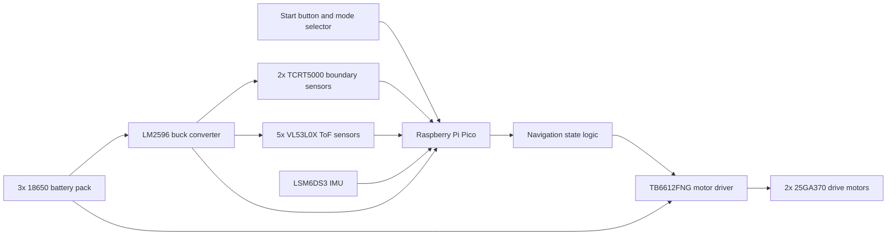

# System Overview

## Project Summary

ZillaBot is an autonomous robot designed for sumo and tug-of-war style competition. The platform was built to detect arena boundaries, identify nearby objects or opponents, and choose movement responses without direct human control during a match.

The final system combines a two-wheel rear-drive layout, floor-facing boundary detection sensors, front-facing time-of-flight sensors, IMU feedback, motor control hardware, a custom CAD chassis, and an integrated PCB.

## Core Objectives

- Build a mobile robot platform with reliable sensing and motion control
- Support autonomous decision-making during matches or trials
- Integrate hardware and software into one repeatable system
- Demonstrate the design process, testing process, and final lessons learned

## High-Level Architecture

ZillaBot can be described as a set of connected subsystems:

- Mechanical subsystem: 3D-printed chassis, enclosure, wheel components, motor mounts, and front attachment geometry
- Electrical subsystem: microcontroller, motor driver, buck converter, audio amplifier, gyroscope, boundary sensors, and time-of-flight sensor array
- Software subsystem: sensor polling, mode selection, navigation state logic, motor command generation, and optional telemetry support

The D2 design-review materials describe the final robot as a set of sensing, decision, motor, power, PCB, and chassis subsystems working together around the Raspberry Pi Pico controller.

## System Diagram

Additional design source files are available in:

- [Architecture diagrams](architecture-diagrams.md)
- [Hardware assets](hardware-assets.md)
- [Media gallery](media-gallery.md)
- [Draw.io diagrams](../diagrams/)

## Major Subsystems

### Mobility

The robot uses a two-wheel rear-drive approach. The navigation software commands differential wheel movement to search, turn, pursue, recover, and drive during competition behavior.

### Sensing

The sensing system combines several inputs:

- floor-facing boundary sensors for arena edge detection
- front-facing time-of-flight sensors for object and opponent detection
- IMU feedback for orientation and heading-related behavior

### Navigation and Decision Logic

The navigation layer uses sensor priority rules and state-based behavior. Boundary and safety conditions take priority, while target detection and pursuit behavior guide the robot during active match modes.

### User Interface or Match Controls

The implementation includes mode selection and startup handling for match-oriented operation. The available public records do not include a finished control-panel diagram, so this section stays at the system-behavior level.

## Design Constraints

The project was shaped by senior design deadlines, competition-style operation, hardware integration limits, and the need for repeatable demonstrations.

- Size limit: 13 cm by 13 cm footprint, with unrestricted height in the competition requirements documented in the D2 materials
- Time constraints: senior design schedule and demonstration deadlines
- Budget constraint: $75 original unit-cost requirement; the final design-review BOM listed a $74.93 unit cost
- Reliability requirements: repeatable startup, stable movement, and reliable boundary detection
- Competition rules or environment: sumo arena and tug-of-war match conditions

## Final Notes

This page is the top-level technical summary. The deeper pages document navigation behavior, testing evidence, hardware assets, and project reflection.
